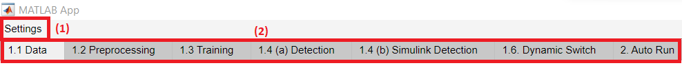
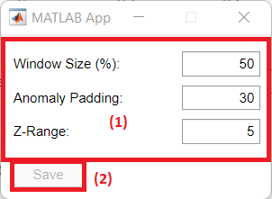
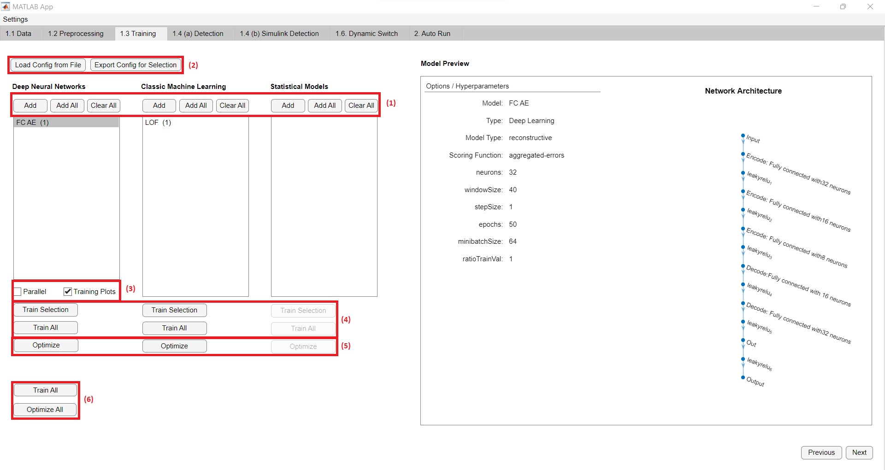
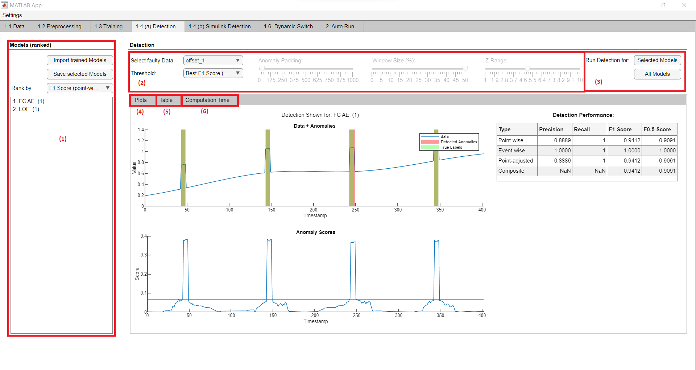

# TSAD Platform Manual

A platform for evaluating time series anomaly detection (tsad) methods which offers options to automatically train, test, compare and optimize them.

## Contents

1. [Getting started](#getting-started)
2. [How to use the platform](#how-to-use-the-platform)
    * [Overview](#overview)
    * [Settings](#settings)
        * [Threshold selection](#threshold-selection)
        * [Dynamic threshold](#dynamic-switch)
        * [Enable/disable parallel mode](#enabledisable-parallel-mode)
    * [Dataset preparation](#dataset-preparation)
        * [Loading a dataset](#loading-a-dataset-1)
        * [Preprocessing the dataset](#preprocessing-and-splitting-the-dataset-2)
    * [Training and optimization](#training-and-optimization)
        * [Load/configure models](#loadconfigure-models-1)
        * [Train and/or optimize models](#train-andor-optimize-models-2)
    * [Detection](#detection)
    * [Simulink detection](#simulink-detection)
    * [Dynamic switch](#dynamic-switch)
    * [Auto run](#auto-run)
3. [Extending the platform](#extending-the-platform)
    * [The "modelOptions" struct](#the-modeloptions-struct)
    * [Configuration file](#configuration-file)
    * [Adding models](#adding-models)
        * [Add deep-learning anomaly detection models](#add-deep-learning-anomaly-detection-models)
        * [Add other models](#add-other-models)
        * [(optional) Enable optimization](#optional-enable-optimization-for-your-model)
        * [(optional) Custom data preparation](#optional-custom-data-preparation)
        * [(optional) Custom threshold](#optional-custom-threshold)
4. [Known limiations](#known-limitations-issues-and-possible-future-upgrades-mostly-relevant-for-developers)

---

## Getting started

1. Download the TSAD platform repository from https://github.com/AdrianWolf1999/tsad_platform.git.
2. Install MATLAB Toolboxes:
    * `Simulink`
    * `Signal Processing Toolbox`
    * `DSP System Toolbox`
    * `Image Processing Toolbox`
    * `Econometrics Toolbox`
    * `Predictive Maintenance Toolbox`
    * `Statistics and Machine Learning Toolbox`
    * `Deep Learning Toolbox`
3. Add the `tsad_platform` folder (the main folder of this repository) to the MATLAB path (without subfolders).
4. Add the `src` folder within the `tsad_platform` folder to the MATLAB path (with subfolders).
5. Add the `config` folder within the `tsad_platform` folder to the MATLAB path.
6. Open the `tsad_platform` folder with MATLAB.
7. Right-click the `TSADPlatform.mlapp` file and click `Run` to start the platform.

---

## How to use the platform

### Overview

On the top of the platform you will find the `Settings` menu and six different `Panels`:



In the [Settings](#settings) you can control the following things:

* [Threshold Selection](#threshold-selection): What thresholds to enable within the platform.
* [Dynamic Threshold](#dynamic-threshold): The default configuration for the dynamic threshold.
* [Enable/Disable Parallel Mode](#enabledisable-parallel-mode): Whether to train in parallel.

The platform offers **two different modes** to test time series anomaly detection methods. The workflows are as such:

#### MODE 1: Manually train and test models

1. Select/configure threshold in the platform [Settings](#settings)
2. Import and process a dataset on the [Dataset Preparation](#dataset-preparation) panel.
3. Configure, train and optimize models on the [Training](#training-and-optimization) panel.
4. Test the models on the [Detection](#detection) and [Simulink Detection](#simulink-detection) panels.
5. (optional) Configure, train and test the dynamic switch mechanism on the [Dynamic Switch](#dynamic-switch) panel (only possible for datasets with multiple files for testing).

#### MODE 2: Automatically train and test models on single- or multi-entity datasets

1. Select/configure thresholds in the platform [Settings](#settings)
2. Configure models on the [Training](#training-and-optimization) panel.
3. Configure and start the auto-run function on the [Auto Run](#auto-run) panel.

Further details can be found below.

---

### Settings

You can find the platform settings in the top left corner.

#### Threshold selection

The selection of thresholds controls which thresholds are set during training and are available during testing ([Mode 1](#mode-1-manually-train-and-test-models)).
Only the selected ones are used during the auto-evaluation on the `Auto Run` panel ([Mode 2](#mode-2-automatically-train-and-test-models-on-single--or-multi-entity-datasets)).

**NOTE** Some models/algorithms (Merlin, OC-SVM, Grubbst test) define their own threshold or don't require one. For these models, none of the available thresholds are applied.

To select thresholds, proceed as follows:

1. Click `Settings > Threshold Selection` to open the threshold selection window.

    

2. Select the desired thresholds.
3. Click `Save` to save the new selection.

The thresholds are used to convert anomaly scores produced by an anomaly detection model/algorithm into binary labels and are set as follows:

| Threshold | Description |
|-|-|
| Best F1 Score thresholds | Calculates the best possible F1 score (either point-wise, event-wise, point-adjusted or composite) on either the anomalous validation set or the test set directly (depending on wether a anomalous validation set is used or not. See [Use of anomalous validation set](#use-of-anomalous-validation-set)). |
| Top k | Set threshold to detect the correct amount of anomalies as given by the labels. This is done either on the anomalous validation set or the test set (depending on wether a anomalous validation set is used or not. See [Use of anomalous validation set](#use-of-anomalous-validation-set)). |
| Mean + 3 * Std | Mean + 3 * Standard deviation of the anomaly scores for the testing data. If the anomaly score output of a model (after a optional scoring function is applied) still has multiple channels, the average mean and average standard deviation across channels are used instead. |
| Mean + 3 * Standard deviation (Train) | Mean + 3 * Std of the anomaly scores for the training data. If the anomaly score output of a model (after a optional scoring function is applied) still has multiple channels, the average mean and average standard deviation across channels are used instead. |
| Max Train Anomaly Score | The maximum value of the anomaly score when running the detection on the training data. |
| 0.5 | 0.5 |
| Dynamic | Unsupervised dynamic threshold. See [Dynamic threshold](#dynamic-threshold). |
| Custom | Can be implemented individually for a specific model. If none is specified, its value is set to 0.5 (See [Add custom threshold](#optional-custom-threshold)). |

#### Dynamic threshold

These options control the default parameters for the dynamic threshold, which can also be configured on the [Detection](#detection) panel. To update their values, proceed as follows:

1. Click `Settings > Dynamic Threshold` to open the dynamic threshold settings window.

    

2. Configure the parameters (1).
3. Click `Save` (2) to save the new parameters.

### Enable/disable parallel mode

To enable/disable parallel training, click on `Settings` and then `Enable Parallel Mode` (or `Disable Parallel Mode` if it's already active).

---

### Dataset preparation

A dataset can be loaded and preprocessed on the `Dataset Preparation` panel:


#### Loading a dataset (1)
1. Click `Browse` to select a folder from your computer or enter a path manually. You can find some datasets in the `datasets` folder of the tsad platform.
2. Click `Load Data` to import the selected dataset.


The **format** of a dataset must be as such:

* It contains at least one of the following folders: a `train` folder containing training data and a `test` folder containing testing data.
* The `test` folder always contains data with anomalies. All models are evaluated on this data.
* The `train` folder is only required for **semi-supervised** and **supervised** models, not for **unsupervised** models as they are tested on the test data directly.
It should contain fault-free data for semi-supervised models and anomalous data for supervised models. Chapter [Load and configure models](#loadconfigure-models-1) shows the learning-types of the implemented models.
* Each folder must contain at least one **CSV** file with the following format:

| timestamp | value1 | value2 | is_anomaly |
|-|-|-|-|
|1|1.2345|0.223|0|
|2|1.2566|0.111|0|
|3|-1.3111|0|1|

* **Timestamp**: The equally spaced timestamps. Can be increasing numeric values or common datatime strings.
* **Values**: The values for the individual channels of the dataset. For univariate data there is just one value-column.
* **is_anomaly**: The anomaly indicators for each observation. 1 = anomaly, 0 = fault-free.

**NOTE** The column-names don't need to be as presented. The platfrom interprets the values of each column according to their position in the file. The first column is always considered the timestamp column and the last column is always considered to be the column of anomaly indicators (=labels). Everything in between are the values of the channels.

#### Preprocessing and splitting the dataset (2)

##### Preprocessing method selection

Three `Preprocessing Methods` can be selected. These **don't** apply to the [Auto Run](#auto-run) functions, but to everything else:

* **Rescale [0, 1]**: Processed data has maximum = 1 and minimum = 0.
* **Standardize**: Processed data has mean = 0 and standard deviation = 1.
* **Raw Data**: Unprocessed data.


**NOTE** The data in the `test` folder gets processed with the same parameters as for the `train` data (with the exception if no train data is used). For the `Rescale [0, 1]` preprocessing method, the testing data additionally gets limited to the range [-4, 5]. All channels of multivariate datasets are preprocessed independently.

##### Data augmentation

You can choose to further transform your data in various ways. To do so, proceed as follows:
1. Select an `Augmentation Mode` from the dropdown menu.
2. Configure the `Intensity` of the augmentation using the slider.
3. Check the `Augmented training` checkbox if you also want to augment the training data.

##### Dataset splitting

###### Data preparation for Dynamic Switch

*INFO: If the dataset  includes multiple files for testing, you can split the test set to use some of the files for testing the [Dynamic Switch](#dynamic-switch) mechanism.*

To enable this, do the following:

1. Check the `Split Test Set for Dynamic Switch` checkbox.
2. Enter a value for the `Ratio` to determine its size.

###### Use of anomalous validation set

*INFO: An anomalous validation set can be used to calculate the static thresholds prior to testing the models (only for semi-supevised models). In order to do this, the test set will be split to obtain an anomalous validation set and a test set. If no anomalous validation set is used, or it doesn't contain any anomalies, the static thresholds will be set on the test set.*

To enable the anomalous validation set, do the following:

1. Check the `Use anomalous Validation Set` checkbox.
2. Enter a value for the `Ratio` to determine its size.

---

### Training and optimization

On the `Training` panel you can train or optimize a selection of models:



To do so, proceed as follows:

#### Load/configure models (1)

Following models are currently available:

* `Deep-learning based models`:
    * **semi-supervised**: 
        * **reconstruction models**: FC-AE, LSTM, Hybrid CNN-LSTM, TCN-AE, 
        * **prediction models**: LSTM, Hybrid CNN-LSTM, GRU, CNN (DeepAnT), ResNet, MLP
* `Others`: 
    * **unsupervised**: iForest (optionally semi-supervised), LOF, LDOF, ABOD, Merlin, over-sampling PCA, Grubbs test
    * **semi-supervised**: OC-SVM, (iForest)

You can load these on the training panel (these are not trained yet, it's only the configuration that gets loaded). 
Once loaded, you can inspect the configuration of a model by selecting it in the list, right-clicking and selecting `Show Model Parameters`. This wil show all parameters of the selected model on the right side of the window (3).

There are **three** ways to load a configuration of models:

##### Method 1: Quick load models

Click `Quick Load all Models` to load a default configuration of all implemented models.
**NOTE** For non-deep-learning models, the data is **not** split into subsequences by default. If you want to enable subsequences for such models, either configure the models manually (see [Method 2: Manually configure models](#method-2-manually-configure-models)) **or** load the config file `tsad_platform_config_all_subsequences_enabled.json` within the `config` folder of the platform (see [Method 3: Exporting and importing a configuration](#method-3---exporting-and-importing-a-configuration)).

##### Method 2: Manually configure models

Click `Add Models Manually` to configure models by hand. This opens a **new window**, allowing you to select a model and configure its parameters:


To configure a model, proceed as follows:
1. At the top (1) you can select the type of model you want to add: Deep Neural Networks or Others (classic machine-learning, statistical).
2. Select a model from the drowpdown menu (2)
3. **Some** models offer the option to configure the dimensionality with the `Is Multivariate` checkbox (3). If this is disabled but the loaded dataset is multivariate, a separate model will be trained for every channel of the data. Otherwise just a single model is used for all channels.
4. **Some** models offer additional configuration options like `scoring functions` or `reconstruction error types` (4).

The `scoring function` defines how anomaly scores are computed. Following scoring functions are currently available:

| Scoring Function | Description |
|-|-|
| aggregated-errors | The mean training reconstruction/prediction error gets subtracted from the channel-wise errors (Only for multivariate datasets). Afterwards, the root-mean-square is taken across channels. For univariate datasets, the errors are used directly. |
| channelwise-errors | The mean training reconstruction error gets subtracted from the channel-wise errors (Only for multivariate datasets). Nothing else is done. For univariate datasets, this is the same as the aggregated-errors scoring function. |
| gauss | A multivariate gaussian distribution is fitted to the trainig errors and used to compute -log(1 - cdf) to get the anomaly scores. **The max supported number of channels in the dataset is 25** |
| aggregated-gauss | The channelwise mean and standard deviation of the training error distribution is used to compute -log(1 - cdf) of the channel-wise errors to get channel-wise anomaly scores. Afterwards, the channelwise anomaly scores are added. |
| channelwise-gauss | The channelwise mean and standard deviation of the training error distribution is used to compute -log(1 - cdf) of the channel-wise errors to get channel-wise anomaly scores. |

**NOTE** For the channel-wise scores, a common threshold gets applied accross all channels during testing. A single observation only needs to be labeled as anomalous in one of the channels to be considered an anomaly.

The `reconstruction error type` defines how the errors are computed for reconstructive deep-learning models. Since there are multiple predicted values for every observation of the time series, a single value must be computed. Following methods to do this are available:

| Reconstruction Error Type | Description |
|-|-|
| median point-wise values | Calculates the median predicted value for each time step and then calculates the absolute errors for the entire time series. |
| median point-wise errors | Calulates the point-wise absolute errors for each subsequence and then calculates the median error for each time step. |
| mean subsequence errors | Calulates the MSE for each subsequence and channel and then calculates the mean error for each time step and channel. |

5. Configure model, data and training related hyperparameters (5)
6. For some non-deep-learning models, you can choose whether to split the data into subsequences by checking the `Use Subsequences` checkbox (6).
**NOTE** Subsequences for non-deep-learning models are **disabled by default**.
7. Once configured, click `Add to Model Selection` to add the selected model to the list of models. You can then repeat the previous steps and add as many models as you wish.

##### Method 3 - Exporting and importing a configuration

You can click `Export Config` to store a configuration file for the configured models on your computer.
This allows you to load a previous configuration of models at another time using the `Load from File` button.

#### Train and/or optimize models (2)

##### Train models

To train models, do the following:

* Click `Train All` to train all configured models.
* Click `Train Selection` to train all manually selected models (click on models to select them).

**NOTE** All models **must** be trained to make them available on the [Detection](#detection) and [Simulink Detection](#simulink-detection) panels. If they don't require prior training, this step is still required (In this case it only adds the model to the list of trained models on the `Detection` panel).

Before training, you can configure the training process as follows:
* Check the `Training Plots` checkbox to enable graphical training plots (currently only for deep-learning models).

**USEFUL** You can update the scoring function and calculate the static thresholds again without having to train the entire model again. To do so, select models in the list, right-click and click `Change Scoring Function` to change the scoring function and then `Update Static Thresholds` to calculate the static thresholds again.

##### Optimize models

The platform offers the possibility to use bayesian hyperparameter optimization.
To optimize models, do the following:

1. Select the models within the list and click `Optimize Selection` or just click `Optimize All` to open a **new window**:

    

2. (optional) Click `Open Optimization Config` to edit the optimization config `JSON` file. This file defines the ranges of hyperparameters to optimize. See Chapter [Enable optimization](#optional-enable-optimization-for-your-model) for information on how to edit this file.
3. Configure the optimization process by selecting:
    * The number of `Iterations` for the optimization (= number of combinations of hyperparameters to check).
    * The `Metric to Optimize`.
    * The `Threshold` used for all models.
    * (optional) Check the `Training Plots` checkbox if you want to show plots for deep-learning models.
4. Click the `Run Optimization` button to start the optimization. For each iteration of the optimization, every model gets tested on all files of the testing dataset and the average score (metric selected in step 3.) is aimed to be improved.
5. Once it's done, the optimized models will appear on the [Detection](#detection) and [Simulink Detection](#simulink-detection) panels.

---

### Detection

The trained models can be tested on the `Detection` panel:



#### Running detections

##### List of trained Models (1)

* All trained models appear in the **list of trained models**. If it's empty, no detection can be run.
* These models are **ranked** according to their detection performance. The metric used for ranking can be manually selected from the dropdown menu at the bottom of the list.
* Models can be **exported** by clicking the `Export trained Models` button. These trained models can be **loaded** directly into the platform via the `Import trained Models` button.

##### Data and threshold selection (2)
1. Select a file from the `Select faulty Data` dropdown menu.
2. Select a threshold from the `Threshold` dropdown menu. If you select the **dynamic** threshold, you can additionally configure its parameters.

##### Run detection (3)

1. Select models from the **list of trained models**.
2. Configure the detection as follows:
    * If you want to get the time a model takes to make predictions for a single subsequence, check the `Get Computation Time` checkbox.
    * To only update the applied threshold and not rerun the entire detection process, check the `Update Threshold only` checkbox (This only has an effect if you ran the detection with this checkbox unchecked before).

3. You can then run the detection for:
    * `Selected models` (ony for selected file)
    * `Selected models on all files`
    * `All models` (only for selected file)
    * `All models on all files`

##### Observe results (4)

Once the detection is finished, the following results are are displayed in the windows below:
* **Plots** of the anomaly scores and detected anoamlies for the first model the detection was run for.
* The **Scores** for the currently selected file and the average scores across all files. These tables can be exported.
* A **Computation time** plot showing the  average computational time of the models for a single subsequence on the x-axis and the obtained scores on the y-axis.
Using the `Metric Selection` button, one can choose what metrics should be displayed within this plot.

You can select another threshold or reconfigure the dynamic threshold. This will update the scores **only** for the currently shown model in the **Plots** section (4). To update it for all models, you need to run the detection again (See [Run detection](#run-detection-3)).

**NOTE** If you want to observe the detection of another model, just right-click on it in the list of trained models (1) and select `Show Detection`. If you already ran the detection for that model, the scores and plots will be displayed directly. Otherwise run the detection for the selected model again.

---

### Simulink Detection

**NOTE The simulink detection isn't fully functional at this point**

The online detection simulation using Simulink is available on the `Simulink detection` panel:


To **run the simulink detection**, proceed as follows:

1. Select models from the **list of trained models** (1).
2. Select a file from the `Select faulty Data` dropdown menu and a threshold from the `Threshold` dropdown menu (2).
3. If you want Simulink to open when running a detection, check the `Open Model` (3) checkbox.
4. Click `Run Detection` (4) to start the online detection simulation. 

---

### Dynamic switch

The dynamic switch mechanism (model selection mechanism) can be trained and tested on the `Dynamic switch` panel:


#### Requirements

The usage of the dynamic switch mechanism **requires** the following things:

* **Correct dataset**: A dataset with **multiple anomalous files** for testing. 
* The **Split Test Set for Dynamic Switch** checkbox on the [Dataset Preparation](#dataset-preparation) panel must be checked. The testing data for the dynamic switch can be observed in section (3).
* **Trained models**: Either configure and train models on the [Training](#training-and-optimization) panel or load trained models on the [Detection](#detection) panel.
* **Detection run**: The detection **must be run for all models** on all files on the [Detection panel](#detection). Otherwise the dynamic switch won't know which models perform best on what kind of data.

#### Run dynamic switch

To **train and test the dynamic switch**, proceed as follows:

##### Configure, train and test dynamic switch (1)

1. Select a `Metric` from the dropdown menu. This metric will be used to compare the performance of models.
2. Click the `Train Classifier` button to train the deep calssification network. It learns to connect time series features with the best performing model according to the selected metric.
3. Click the `Run Evaluations` button to test the dynamic switch. The **threshold** used for all models is the one selected on the [Detection panel](#detection).

##### Observe results (2), (4)
All results including the scores obtained by all individual models will be displayed in the table (4). You can see the best models for the training data of the dynamic switch and the predictions it made for the testing data in the lists at the bottom (2).

---

### Auto run

Automatically train and test models on single- or multi-entity datasets on the `Auto Run` panel:


#### Running automated training and detection

To use this function, proceed as follows:

##### Prequisites

1. Select the thresholds in the [Settings](#settings) of the platform
2. (optional) If the dynamic threshold was selected, configure it in the [Settings](#settings).
3. Configure/load models on the [Training](#training-and-optimization) panel **(don't train them yet)**.

##### Configure and start auto run (1)

1. Select a dataset on the [Auto Run](#auto-run) panel by clicking the `Browse` button.
2. Configure the data preparation similar to [Mode 1](#dataset-preparation).
3. If you want to get the time a model takes to make predictions for a single subsequence, check the `Get Computation Time` checkbox.
4. Click `Run Evaluation` to start the process. You can observe more details about the current state in the MATLAB command window.

##### Observe results (2)
Once the evaluation is done, all results are stored in a folder called *Auto_Run_Results* within the current MATLAB folder (This folder includes subfolders for the results for each selected threshold). The average scores for each model for the first threshold are displayed in the table (2).

---

## Extending the platform

### The "modelOptions" struct

The platform recognizes a model/algorithm by its configuration. This configuration is stored in a struct with a single key called **`modelOptions`**.
The value of this key contains all relevant information. When adding a configured model to the list of models on the [Training](#training-and-optimization) panel, the **ItemsData** property of that list (which is a struct array in this platform) gets extended by such a struct.

The following figure shows an example for the fully-connected autoencoder (FC-AE):

```json
"modelOptions": {
    "type": "deep-learning",
    "name": "FC-AE",
    "modelType": "reconstructive",
    "dataType": 1,
    "learningType": "semi-supervised",
    "isMultivariate": true,
    "outputsLabels": false,
    "hyperparameters": {
        "neurons": 32,
        "windowSize": 100,
        "stepSize": 1,
        "epochs": 50,
        "learningRate": 0.001,
        "minibatchSize": 64,
        "ratioTrainVal": 0,
        "reconstructionErrorType": "median point-wise values",
        "scoringFunction": "aggregated-errors"
    }
}
```

Fields of the **modelOptions** struct (and whether they're required or not):

#### type
**- mandatory -**
The type of the model/algorithm. Must be one of: `"deep-learning"`, `"classic-machine-learning"`, `"statistics"`

#### name
**- mandatory -**
The unique name of the model. This is used by the platform to recognize the model.

#### modelType
**- optional -**
This field is only required for deep-learning models using the standard deep-learning functions probided by the platform. Its value must be one of: `"predictive"`, `"reconstructive"`. It indicates whether the model produces prediction or reconstruction errors.

#### dataType
**- optional -**
This field is only required if your model uses the data preparation function provided by the platform (and if for classic machine-learning and statistical models the [useSubsequences](#usesubsequences) field is set to true).
Its value must be one of: `1`, `2`, `3`. The number controls the shape of the data. The data is always split into **subsequences** of equal length using a sliding window. The window-size (and step-size for training, if your model is semi-supervised or supervised) must be defined in the [hyperparameters](#hyperparameters) field.
The step-size for the testing data is always set to 1.
For the three different data types, the data will be shaped as such:
| Data type | Description |
|-|-|
| **1** | A `N x (w * d)` matrix with `N` being the number of observations, `w` the window size and `d` the number of channels. |
| **2** | A `N x 1` cell array with `N` being the number of observations. Each cell contains a matrix of size `d x w` with `d` being the number of channels and `w` being the window size. |
| **3** | A `N x 1` cell array with `N` being the number of observations. Each cell contains a matrix of size `w x d` with `d` being the number of channels and `w` being the window size. |

**NOTE** For reconstructive deep-learning models, only dataType 1 and 2 are available.

#### learningType
**- mandatory -**
The learning type determines what data is used for training and testing. Following learning types are possible:

| Learning type | Description |
|-|-|
| "supervised" | Model gets trained on training data from `train` folder (Should contain anomalies). Training data is also used to set static thresholds, if the model doesn't output labels. |
| "semi-supervised" | Model gets trained on training data from `train` folder (Should not contain anomalies). Anomalous validation data (if available) is used to set static thresholds. Otherwise static thresholds are set last during testing. |
| "unsupervised" | Model gets tested directly on data from `test` folder. Static thresholds are alway set last. | 

#### isMultivariate
**- mandatory -**
Its value can be `true` or `false` according to the dimensionality of your model. **If it is set to `false` but the loaded dataset is multivariate, a separate model will be trained for each channel of the dataset.**

#### outputsLabels
**- mandatory -**
If your anomaly detection method doesn't output anomaly scores, but binary labes for each observation of the time series, set this field to `true` to bypass all thresholding methods. Otherwise it must be set to `false`.

#### useSubsequences
**- optional -**
This field is only required for **non** deep-learning models which use the standard data preparation functions provided by the platform.
If it is set to `true`, the dataset will be split into overlapping subsequences (See field [dataType](#datatype) above), otherwise the data is used directly.

#### hyperparameters
**- optional -**
This field can contain all configurable hyperparameters for your model/algorithm. If you want to add a hyperparameter, specify its name as a new key within this field.
You can then use these hyperparameters in the data preparation, model training and detection functions to modify your model.
See Chapter [adding models](#adding-models) for some examples.

One hyperparamter that must be mentioned is the `scoringFunction`:
It is optional for all models. Its value changes how the anomaly scores are defined. If your model defines its own scoring function, don't add this field to the hyperparameters.
Currently available scoring functions can be found in Chapter [Load/configure models](#loadconfigure-models-1).

### Configuration file

The file `tsad_platform > config > tsad_platform_config_all.json` contains the JSON representation of a MATLAB struct with a single field called models. Its value is a struct array with individual `modelOptions` structs, as presented before. This file is used for loading the default configuration of models on the [Training](#training-and-optimization) panel using the `Quick Load all Models` button:

```json
{
    "models": [
        {
            "modelOptions": {
                ...
            }
        },
        {
            "modelOptions": {
                ...
            }

        }
    ]
}
```

### Adding models

To add more models to the platform (deep-learning, classic machine learning or statistical), proceed as follows:

1. Define the `modelOptions` struct mentioned before. You can create a `JSON` file (use the `tsad_platform_config_all.json` file as reference or add your model to this file directly) as mentioned above. Alternativeley, edit the `ModelSelection.mlapp` file within the `src > pupup_apps` folder. Use other examples in that file as a guideline on how to add your model.
2. Add the training and detection function calls to the source code of the platform. The process for deep-learning and other models (E.g. classic machine-learning and statistical algorithms) slightly differs.
See [Add deep-learning anomaly detection models](#add-deep-learning-anomaly-detection-models) and [Add other models](#add-other-models) for more information.
3. (optional) Enable optimization for your model: [Enable optimization](#optional-enable-optimization-for-your-model).
4. (optional) If you require the data to be transformed in another way as provided by the platform, see [Custom data preparation](#optional-custom-data-preparation) for more information.
5. (optional) [Add custom threshold](#optional-custom-threshold).


#### Add deep-learning anomaly detection models

It's recommended to implement the deep-learning models using functions from MATLAB's Deep Learning Toolbox and using the data preparation methods provided by the platform (this data preparation mode is enabled by default and nothing needs to be done other than adding the `dataType` field to the `modelOptions` struct (see [above](#the-modeloptions-struct))). To add a new deep-learning model, follow these steps:

1. **Define the layers**: Go to the folder `tsad_platform > src > models_and_training > deep_learning` and open the file `getLayers.m`. Add a new option in the main *switch* statement for the name of your model:

    ```matlab
    switch modelOptions.name
        % Add your model here
        case "Your model name"
            % Get hyperparameters from options
            neurons = modelOptions.hyperparameters.neurons;

            % Define layers
            layers = [ ...
                featureInputLayer(numFeatures)
                fullyConnectedLayer(neurons)
                reluLayer()
                fullyConnectedLayer(numResponses)
                regressionLayer()];
            
            layers = layerGraph(layers);
    ```

2. **Define training options**: Go to the folder `tsad_platform > src > models_and_training > deep_learning` and open the file `getTrainOptions.m`. Add a new option in the main *switch* statement for the name of your model. If you don't add your model here, default training options will be used. Look at the example for more information:

    ```matlab
    switch modelOptions.name
     % Add your model here
        case "Your model name"
            % Define different options depending on whether validation data is available
            if modelOptions.hyperparameters.ratioTrainVal == 0
                trainOptions = trainingOptions("adam", ...
                                                Plots=plots, ...
                                                Verbose=verbose, ...
                                                MaxEpochs=modelOptions.hyperparameters.epochs, ...
                                                MiniBatchSize=modelOptions.hyperparameters.minibatchSize, ...
                                                GradientThreshold=1, ...
                                                InitialLearnRate=modelOptions.hyperparameters.learningRate, ...
                                                Shuffle="every-epoch",...
                                                ExecutionEnvironment=device);
            else
                trainOptions = trainingOptions("adam", ...
                                                Plots=plots, ...
                                                Verbose=verbose, ...
                                                MaxEpochs=modelOptions.hyperparameters.epochs, ...
                                                MiniBatchSize=modelOptions.hyperparameters.minibatchSize, ...
                                                GradientThreshold=1, ...
                                                InitialLearnRate=modelOptions.hyperparameters.learningRate, ...
                                                Shuffle="every-epoch", ...
                                                ExecutionEnvironment=device, ...
                                                ValidationData={XVal, YVal}, ...
                                                ValidationFrequency=floor(numWindows / (3 * modelOptions.hyperparameters.minibatchSize)));
            end
    ```

**NOTE** You can **optionally** add the training and detection function call for your network manually. In that case you don't have to add your model to the files mentioned above. To do so proceed as follows:

1. **Add the training function call for you network**: Go to the folder `tsad_platform > src > models_and_training > deep_learning` and open the file `train_DL.m`. Add your model name within the main *switch* statement, then call your training function and save the trained network in the `Mdl` vairable. The `MdlInfo` variable is optional and can be left empty:

    ```matlab
    switch modelOptions.name
        % Add your model here
        case "Your model name"
            Mdl = yourTrainFunction(XTrain, YTrain, XVal, YVal);
            MdlInfo = [];
    ```

2. **Add the detection call for your network**: Go to the folder `tsad_platform > src > detection` and open the file `detectWith_DL.m`. Add your model name within the main *switch* statement, then add your detection function call. Make sure to save the prediction of your model in the `anomalyScores` variable (even if your model outputs labels):

    ```matlab
    switch modelOptions.name
        % Add your model here
        case "Your model name"
            anomalyScores = detectWithYourModel(Mdl, XTest);
    ```

#### Add other models

The process for adding models other than deep-learning models is as follows:

1. **Add the training function call**: This step is only required if your model is semi-supervised or supervised (see [Learning type](#learningtype)).
 Go to the folder `tsad_platform > src > models_and_training > other` and open the file `train_Other.m`. To train your model, add your model name to the main *switch* statement, then call your training function and save the trained model in the `Mdl` variable:

    ```matlab
    switch modelOptions.name
        % Add your model here
        case "Your model name"
            Mdl = trainYourModel(XTrain);
    ```

2. **Add the detection function call**: Go to the folder `tsad_platform > src > detection` and open the file `detectWith_Other.m`. Add your model name within the main *switch* statement, then add your detection function call. Make sure to save the prediction of your model in the `anomalyScores` variable (even if your model outputs labels):

    ```matlab
    switch modelOptions.name
        % Add your model here
        case "Your model name"
            anomalyScores = detectWithYourModel(Mdl, XTest);
    ```

#### (Optional) Enable optimization for your model

To enable the built-in optimization for your model, open the file `tsad_platform > config > tsad_platform_config_optimization.json`.
Add your model name as a new key. Then name the hyperparameters you want to optimize as new keys within this new field. Only hyperparameters which are defined in the `hyperparameters` field of the `modelOptions` struct of your model can be optimized. See the following dummy example for reference:

```json
{
    "My model": {
        "parameter1": {
            "value": [1, 1000],
            "type": "integer"
        },
        "parameter2": {
            "value": ["8", "16", "32", "64", "128", "256"],
            "type": "categorical"
        }
    }
}
```
There are **two** different ways to add a hyperparameter to this file:

##### 1 - Specify lower and upper bounds
If you want to specify the lower and upper bounds for a hyperparameter, set the `type` to `"integer"` or `"real"`, depending on the type of your hyperparameter. In this case, the `value` must be an array with two values being the lower and upper bounds of the hyperparameter.

##### 2 - Specify discrete possible values
If you want to limit the possible values for a hyperparameter during optimization, set the `type` to `"categorical"`. In this case the `value` is an array of strings containing the possible values. For numerical hyperparameters, you also **MUST** specify the values as strings (see example above). The platform will interpret the values correctly.

#### (Optional) Custom data preparation

To prepare the data your own way, you can add your model name to the main *switch* statements in the following files within the `tsad_platform > src > data_preparation` folder and then call your own data preparation functions:

* **For deep-learning models**: `prepareDataTrain_DL.m`, `prepareDataTest_DL.m`.
* **For other models**: `prepareDataTrain_Other.m`, `prepareDataTest_Other.m`.

**NOTE** If you do so, you must also call your own training and detection functions as described above. Otherwise it might lead to errors as the platform doesn't recognize your data.

#### (Optional) Custom Threshold

To add a custom threshold, open the file `tsad_platform > src > thresholds > calcStaticThreshold.m`. In line `50` add your model name and store your custom threshold in the `thr` variable.

```matlab
case "custom"
        switch modelName
            case "Your model name"
                % Add your custom threshold here
            otherwise
                thr = 0.5;
        end
```

## Known limitations, issues and possible future upgrades (Mostly relevant for developers)

1. Optimize the threshold calculation (in file computeBestFScoreThreshold.m). It can be slow, especially for larger datasets, as it checks the F-Score for every single unique anomaly score value of the used time series (either anomalous validation set or test set). An upper bound of threshold values to check could be implemented to counter this issue.
2. The simulink detection doesn't implement the different data preparation methods and scoring functions for the different deep-learning models, which makes it non-functional in many cases. The functionality of using a univariate model on multivariate datasets, where a separate model is trained for each channel of the dataset, must be implemented aswell. This feature already exists in the normal detection mode (It can be enabled by setting the `isMultivariate` field to `false` for a model).
3. (Maybe irrelevant?) The step-size for the detection process is always set to 1 and can't be adjusted.
4. (Maybe irrelevant?) The forecast horizon for deep-learning models is always set to 1 and can't be adjusted.
5. Network architectures of deep-learning models could be checked in more detail or updated. For example the TCN-AE currently only accepts window-sizes that are divisible by 4.
6. Check on startup of the platform whether all required folders are on the matlab path to avoid errors later on.
7. Add more models (The platform lacks for example in statistical models. Classic machine-learning oder deep-learning models like a Convolutional Autoencoder or a LSTM Autoencoder could also be added. **Note** The implemented LSTM and Hybrid CNN-LSTM reconstruction models don't feature any dimensionality reduction).
8. (Maybe irrelevant?) Save intermediate results during auto run. This allows to save some results even when a longer running process crashes.
9. On some datasets, the training of some deep-learning models can occasionally get stuck. The reasons for this might be further investigated in the future (Maybe related to preprocessing, network architectures, dataset in general, etc.).
