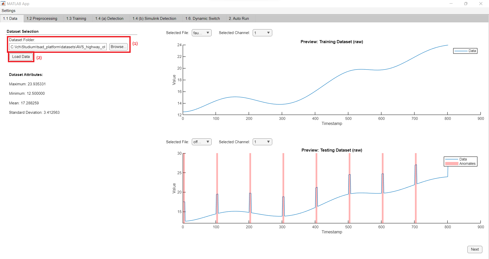
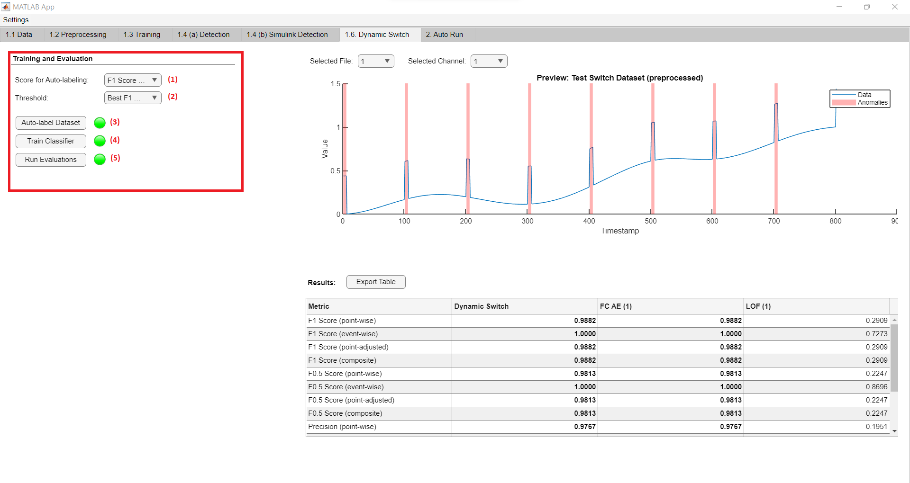

# TSAD Platform Manual
A platform for time series anomaly detection.

## Getting Started

1. Download the TSAD Platform repository from `https://github.com/AdrianWolf1999/tsad_platform.git`.
2. Download the Anomaly Detection Toolbox from `https://github.com/dsmi-lab-ntust/AnomalyDetectionToolbox.git`.
3. To use MERLIN, download it and add it to the MATLAB path.
3. Add the Anomaly Detection Toolbox to the MATLAB path.
4. Add the `tsad_platform` folder to the MATLAB path (without subfolders).
5. Add the `src` and `Sim Models` folders to the MATLAB path (with subfolders).
6. Open the `tsad_platform` folder with MATLAB.
7. Open the `TSADPlatform.mlapp` file with MATLAB App Designer (double click on it).
8. Click the `Run` icon on the top of the App Designer window to start the platform.

---

## Overview

On the top of the platform you will find the `Settings` menu (1) and seven different `Panels` (2):


In the [Settings](#settings) you can control the following things:

* [Threshold Selection](#threshold-selection): What thresholds to enable within the platform
* [Dynamic Threshold](#dynamic-threshold): The default configuration for the dynamic threshold
* [Optimization](#optimization-logging): Whether to export logdata during an optimization process

**Manually train and test models:**

1. Import a dataset on the [Data](#data-preparation) panel.
2. Split and process the dataset on the [Preprocessing](#preprocessing-methods) panel.
3. Configure, train and optimize models on the [Training](#training-and-optimization) panel.
4. Test the models on the [Detection](#detection) and [Simulink Detection](#simulink-detection) panels.

**Train and test the dynamic switch mechanism:**

1. Import a dataset on the [Data](#data-preparation) panel.
2. Split and process the dataset on the [Preprocessing](#preprocessing-methods) panel.
3. Configure and train models on the [Training](#training-and-optimization) panel.
2. Configure, train and test the dynamic switch mechanism on the [Dynamic Switch](#dynamic-switch) panel.

**Automatically train and test models on single- or multi-entity datasets:**

1. Configure models on the [Training](#training-and-optimization) panel.
2. Configure and start the auto-run function on the [Auto Run](#auto-run) panel.

---

## Settings

You can find the platform settings in the top left corner.

### Threshold selection

The selection of thresholds controls which thresholds are calculated by the platform.
Only the selected ones are used during the auto-evaluation on the `Auto Run` panel.

To select thresholds, proceed as follows:

1. Click `Settings > Threshold Selection` to open the threshold selection window.

    

2. Select the desired thresholds (1).
3. Click `Save` (2) to save the new selection.

### Dynamic threshold

These options control the default parameters for the dynmaic threshold, which can also be configured on the `Detection` panel. To update their values proceed as follows:

1. Click `Settings > Dynamic Threshold` to open the dynamic threshold settings window.

    

2. Configure the parameters (1).
3. Click `Save` (2) to save the new parameters.

### Optimization logging

During an optimization, the platform has the ability to export all scores for each iteration of the optimization process to a folder called `Optimization_Logdata` within the current MATLAB folder.
To enable this feature, proceed as follows:

1. Click `Settings > Optimization` to open the optimization settings window.

    

2. Check the `Export Logdata` box (1).
3. Click `Save` (2) to save your changes.

---

## Importing a dataset

A dataset can be loaded on the `Data` panel:



1. On the `Data` panel, click `Browse` (1) to select a folder from the computer or enter a path manually.
2. Click `Load Data` (2) to import the selected dataset.

The **format** of a dataset must be as such:
* It contains a folder called `test` (mandatory) and a folder called `train` (optional for unsupervised anomaly detection methods).
* Each folder contains an arbitrary amount of **CSV** files with the following format:

| timestamp | value1 | value2 | is_anomaly |
|-|-|-|-|
|1|1.2345|0.223|0|
|2|1.2566|0.111|0|
|3|-1.3111|0|1|

**Timestamp**: The equally spaced timestamps. Can be increasing numeric values or common datatime strings.
**Values**: The values for the individual channels of the dataset. For univariate data there is just one value-column.
**is_anomaly**: The anomaly indicators for each observation. 1 = anomaly, 0 = fault-free.

**NOTE** The column-names don't need to be as presented. The platfrom interprets the values of each column according to their position in the file. The first column is always considered the timestamp column and the last column is always considered to be the column of anomaly indicators. Everything in between are the values of the channels.

---

## Preprocessing and splitting the dataset

The dataset can be split and processed on the `Preprocessing` panel


### Preprocessing method selection

Three preprocessing methods can be selected (1). These don't apply to the [Auto Run](#auto-run) functions.

* **Raw Data**: Unprocessed data.
* **Standardize**: Set mean = 0 and standard deviation = 1.
* **Rescale [0, 1]**: Set maximum = 1 and minimum = 0.

**NOTE** The data in the `test` folder gets processed with the same parameters as for the `train` data (with the exception if no train data is used). All channels of multivariate datasets are preprocessed independently.

### Data preparation for Dynamic Switch

If the dataset includes multiple files for testing, you can split the test set to use some of the files for testing the [Dynamic Switch](#dynamic-switch) mechanism.
To enable this, do the following:

1. Check the `Split Test Set for Dynamic Switch` box (2).
2. Enter a value for the `Ratio` to determine its size.

### Use of anomalous validation set

An anomalous validation set can be used to calculate the static thresholds prior to testing the models. If it's not available or doesn't contain any anomalies, most of the static thresholds will be calculated last during testing.
To enable the anomalous validation set, do the following:

1. Check the `Use anomalous Validation Set` box (3).
2. Enter a value for the `Ratio` to determine its size.

---

## Training and optimization

On the `Training` panel you can train or optimize a selection of models.


To do so, proceed as follows:

### Load/configure models

There are **three** ways to load a configuration of models (These are not trained yet, it's only the configuration that gets loaded):

* Click `Add` (1) on top of one of the three lists to add either a **Deep Learning**, **Classic Machine Learning** or **Statistical** anomaly detection model. This opens a **new window**, allowing you to select a model and configure its parameters. Once configured, click `Add to Model Selection` to add the selected model to the list of models.
* Click `Add All` (1) to add a default configuration of all models.
* You can select multiple models from all lists and click `Export Config for Selection` (2) to store a configuration file on your computer.
This allows you to load a previous configuration of models at another time using the `Load from File` (2) button.

### Train models

To train models, do the following:

* Click `Train All` (4) to train all configured models within the respective list.
* Click `Train Selection` (4) to train all manually selected models within the respective list (Click on models to select them).
* Click `Train All` (6) at the bottom to train all configured models of all types.

**NOTE** All models **must** be trained to make them available on the [Detection](#detection) and [Simulink Detection](#simulink-detection) panels. If they don't require prior training, this step is still required (In this case it only adds the model to the list of trained models on the `Detection` panel)

Before training **deep learning** models, you can configure the training process as follows:

* Check the `Parallel` (3) checkbox to enable parallel training of deep learning models.
* Check the `Training Plots` (3) checkbox to enable graphical training plots.

### Optimize models

To optimize a **single model**, do the following:
1. Select **one** model.
2. Click the `Optimize` button (5) below the list. This opens a **new window**:

    

3. (optional) Uncheck the `Use Preconfigured Hyperparameter Range` checkbox and click the `Add` button. This opens a **new window** for defining ranges of hyperparameters:

    

    Select and configure the parameter and press `Add` to add it to the list.
    Only these hyperparameters will be varied within the specified range during the optimization process.
5. Enter a value for the number of `Iterations` for the optimization function.
4. Select a `Score` you want to be improved.
6. Select a `Threshold`
7. To show training plots for deep learning models, check the `Training Plots` checkbox.
8. Click `Run Optimization` to start the optimization process. This opens windows showing the progress of the bayesian optimization.
9. Once it's done, the model with the best configuration will be added to the list of models.

To optimize **multiple models** automatically, do the following:

1. Select the models within the lists.
2. Click `Optimize` (5) to open a **new window**. The `Optimize All` button (6) at the bottom of the panel can be used to optimize all configured models of all types.

    

3. Configure the optimization process by selecting a `Score`, a `Threshold` and check the `Training Plots` checkbox if you want to show plots for deep learning models.
4. Click the `Run Optimization` button to optimize all models.
5. Once its done, the models with the best configuration will be added to the list of models.

**NOTE** You need to train the optimized models before they're available on the [Detection](#detection) panel.

---

## Detection

The offline anomaly detection using the models trained earlier (see [Training and optimization](#training-and-optimization)) is available on the `Detection` panel.


**List of trained Models (1)**

* All trained models appear in the **list of trained models**.
* These are **ranked** according to their detection performance. The metric used for ranking can be manually selected from the dropdown menu at the top of the list.
* Models can be selected within the list and **saved** by clickin the `Save selected Models` button.
* Trained models can be **loaded** directly into the platform via the `Import trained Models` button.

**Detection section**

To **run a detection**, proceed as follows:

1. Select a file from the `Select faulty Data` dropdown menu (2).
2. Select a threshold from the `Threshold` dropdown menu (2). If you select the **dynamic** threshold, you can additionally configure its parameters (2).
3. Select models from the **list of trained models** and click `Selected Models` or click `All Models` (3) to start the detection process.
4. Once the detection is finished, the following results are are displayed in the windows below:
    * **Plots** (4) of the anomaly scores and detected anoamlies for the last model the detection was run for.
    * A **Table** (5) storing all scores for all models and the computational time of deep-learning models (time to make predictions for one subsequence)
    * A **Computation time** plot (6) showing the computational time of the models on the x-axis and the obtained scores on the y-axis.
    Using the `Metric Selection` button, one can choose what metrics should be displayed within the plot.

You can select another threshold or reconfigure the dynamic threshold. This will update the scores for the currently shown model in the **Plots** section (4). To run it again for all models, click the `All Models` button (3) again.

---

## Simulink Detection

MISSING IMAGE

To **run the simulink detection**, proceed as follows:

1. Select a file from the `Select faulty Data` (2) dropdown menu.
2. Select a threshold from the `Threshold` (3) dropdown menu.
3. Select models from the **list of trained models** (1) and click `Run Detection` (5) to start the online detection simulation. If you additionaly checked the `Open Model` (4) checkbox before running the detection, Simulink will open.

---

## Dynamic switch



The usage of the dynamic switch mechanism **requires** the following things:

* **Correct dataset**: A **Univariate** dataset with **multiple anomalous files** for testing. The `Split Test Set for Dynamic Switch` checkbox on the [Preprocessing](#preprocessing-and-splitting-the-dataset) panel must be checked.
* **Trained models**: Either configure and train models on the [Training](#training-and-optimization) panel or load trained models on the [Detection](#detection) panel.

To **train and test the dynamic switch**, proceed as follows:

1. Select a metric from the `Metric` dropdown menu (1). This will be used to compare the models during auto-labeling.
2. Select a threshold from the `Threshold` dropdown menu (2). This threshold will be used for all models.
3. Click the `Auto-label Dataset` button (3). This runs the detection for all models on all files of the test dataset (without the files for testing the dynamic switch).
4. Click the `Train Classifier` button (4) to train the deep calssification network. It learns to connect time series features with the correct labels determined in step 3.
5. Click the `Run Evaluations` button (5) to test the dynamic switch. All results including the scores obtained by all individual models will be displayed.

---

## Auto run

This is a powerful tool to automatically train and test models on single- or multi-entity datasets.


To use this function, proceed as follows:

1. Select the thresholds in the [Settings](#settings) of the platform
2. (optional) If the dynmaic threshold was selected, configure it in the [Settings](#settings).
3. Configure/load models on the [Training](#training-and-optimization) panel.
4. Select a dataset on the [Auto Run](#auto-run) panel by clicking the `Browse` (1) button.
5. Select a `Preprocessing Method` from the drop down menu (2).
6. Check the `Use anomalous Validtaion Set` checkbox (3) if you want to extract an anomalous validation set from the test set. Specifiy the `Ratio` to determine its size.
7. Enter a value for the `Fraction of Dataset to Use` field (4). This only determines how many subsets of a multi-entity dataset should be tested.
8. Check the `Train Parallel` checkbox (5) to enable parallel training of deep-learning models.
9. Check the `Training Plots` checkbox (6) to enable plots during training of deep-learning models.
10. Click `Run Evaluation` (7) to start the process. You can observe more details about the current state in the MATLAB command window.
11. Once it's done, all results are stored in a folder called *Auto_Run_Results* within the current MATLAB folder.

## Extending the platform

### The "options" struct
The platform recognizes a model/algorithm by its configuration. This configuration is stored in a struct with a single key called **"options"**.
The value of this key contains all relevant information. When adding a configured model to one of the lists of models on the [Training](#training-and-optimization) panel, the **ItemsData** property of that list (which is a struct array in this platform) gets extended by such a struct.

The following figure shows an example for the fully-connected autoencoder (FC AE):
```json
"options": {
    "type": "DNN",
    "model": "FC AE",
    "scoringFunction": "aggregated-errors",
    "modelType": "reconstructive",
    "dataType": 1,
    "label": "FC AE  (1)",
    "id": "FC_AE_1",
    "requiresPriorTraining": true,
    "isMultivariate": false,
    "outputsLabels": false,
    "hyperparameters": {
        "model": {
            "neurons": {
                "value": 32,
                "type": "integer"
            }
        },
        "data": {
            "windowSize": {
                "value": 100,
                "type": "integer"
            },
            "stepSize": {
                "value": 1,
                "type": "integer"
            }
        },
        "training": {
            "epochs": {
                "value": 50,
                "type": "integer"
            },
            "minibatchSize": {
                "value": 64,
                "type": "integer"
            },
                "ratioTrainVal": {
                "value": 1,
                "type": "real"
            }
        }
    }
}
```
Fields of the **options** struct:

**type**
The type of the model/algorithm. Must be one of: `"DNN"`, `"CML"`, `"S"`

**model** 
The identifier for the model. This is used by the platform to recognize the model. It should only contain **letters** and the following characters: `-`, `(`, `)`.

**scoringFunction**

This field is only required for DL models. Its value changes how the anomaly scores are defined:

| Value | Description |
|-|-|
| aggregated-errors | The mean training reconstruction error gets sutracted from the channel-wise errors (Only for multivariate datasets). Afterwards, the root-mean-square is taken across channels. |
| gauss | The channelwise mean and standard deviation of the training error distribution is used to compute -log(1 - cdf("channelwise errors")) of the channel-wise errors to get channel-wise anomaly scores. Afterwards, the channelwise anomaly scores are added. |
| channelwise-errors | The mean training reconstruction error gets subtracted from the channel-wise errors (Only for multivariate datasets). Nothing else is done. |

**modelType**
This field is only required for DL models. Its value must be one of: `"predictive"`, `"reconstructive"`. It indicates whether the model produces prediction- or reconstruction errors.

**dataType**
This field is only required for DL models. It's value must be one of: `1`, `2`, `3`. The number controls the shape of the data for the DL model. The data is always split into subsequences of equal length using a sliding window. For the three different numbers, the data will be shaped as such:
| Data type | Univariate model | Multivariate model |
|-|-|-|
| **1** | `1 x D` cell array with `D` being the number of channels. For each channel a separate model of the same type will be trained (Only for deep learning models). Each cell contains a `N x w` matrix with `w` being the window-size and `N` being the number of observations.| `1 x 1` cell array containing a `N x (w * d)` matrix with `N` being the number of observations, `w` the window size and `d` the number of channels. |
| **2** | `1 x D` cell array with `D` being the number of channels. For each channel a separate model of the same type will be trained (Only for deep learning models). Each cell contains a `N x 1` cell array with `N` being the number of observations. Each cell is a matrix of size `1 x w` with `w` being the window-size. | `1 x 1` cell array containing a `N x 1` cell array with `N` being the number of observations. Each cell contains a matrix of size `d x w` with `d` being the number of channels and `w` being the window size. |
| **3** | `1 x D` cell array with `D` being the number of channels. For each channel a separate model of the same type will be trained (Only for deep learning models). Each cell contains a `N x 1` cell array with `N` being the number of observations. Each cell is a matrix of size `w x 1` with `w` being the window-size. | NOT AVAILABLE! |

**label**
The label for the model. It is only displayed on the lists on the training panel. It **MUST** be the the same as the `model` field followed by **two whitespaces and a number in brackets**. Example: **FC AE &nbsp;(1)**. **This field gets automatically set by the platform and only needs to be specified in the `config_all.json` file**.

**id**
The id is the same as the `label` field but with all non-letter character being replaced by `_`. For multiple consecutive non-letter characters, only a single `_` must be insterted. This field is automatically set by the platform, **BUT** when running test using a configuration file, it must be manually set. Once the platform finished training all models, it creates a struct of trained models. The fieldnames of this struct are the **ids** specified in this field of the options struct.


**requiresPirorTraining**
If this is set to **false**, the model is trained on the data from the **train** folder. If it is set to **true**, the model gets traied on the anomalous validation set from the **test** folder.

**isMultivariate**
Set this to `true` if the model is suited for multivariate data. Otherwise set it to `false`. **(Only for deep learning models: If it is set to `false` but the loaded dataset is multivariate, a separate model will be trained for each channel of the dataset.)**

**outputsLabels**
If your anomaly detection method doesn't output anomaly scores, but binary labes for each observation within the time series, set this field to `true` to bypass all thresholding methods. Otherwise it must be set to `false`.

**hyperparameters**
This field can contains all configurable hyperparameters for your model/algorithm. It's value is another struct array. The hyperparameters should be separated into three groups: **model**, **data** and **training** related hyperparameters, which are all separate fields within this struct. If you want to add a hyperparameter, specify it's name as a new key within on of the aforementioned fields (model, data, training). It must contain two keys: **value** and **type**. The type is only required for the optimization algorithm of the platform. It must be one of: `"integer"`, `"real"`, `"categorical"`.

The file `config_all.json` contains the JSON representation of a MATLAB struct with separate fields for DNN, CML and statistical models. Each field's value is a struct array with individual "options" structs, as presented before:
```json
{
    "DNN_Models": [
        {
            "options": {

            }
        },
        {
            "options": {

            }

        }
    ],
    "CML_Models": [

    ],
    "S_Models": [

    ]
}
```

### Adding models

To add more models to the platform (deep learning, classic machine learning and statistical), proceed as follows:

1. Define the `options` struct mentioned before. You can create a `.json` file as mentioned before to be able to load your model into the platform. Alternativeley, edit on of the following files: `ModelSelection_DNN.mlapp`, `ModelSelection_CML.mlapp`, `ModelSelection_S.mlapp`. Use other examples in those files as a guideline on how to add your model.
2. **(optional)** Edit the `conifg_optimization.json` file within the `tsad_platform > src > config` folder and define a range of hyperparameters. Look at the other examples in that file as a guideline.
3. Add the training and detection function calls to the source code of the platform. See below for a detailed explanation.
4. If you require the data to be transformed in another way as provided by the platform, see below for more information.

#### Add deep learning anomaly detection models

It's recommended to implement the deep learning models using functions from MATLAB's Deep Learning Toolbox. To do so, follow these steps:

1. **Define the layers**: Go to the folder `tsad_platform > src > models > deep_neural_networks` and open the file `getLayers.m`. Add a new option in the main *switch* statement for the name of your model:
    ```
    switch options.model
        % Add your model here
        case 'Your model name'
            % Get hyperparameters from options
            neurons = options.hyperparameters.model.neurons.value;

            % Define layers
            layers = [featureInputLayer(numFeatures)
                fullyConnectedLayer(neurons))
                reluLayer()
                fullyConnectedLayer(numResponses)
                regressionLayer()];
            
            layers = layerGraph(layers);
    ```
2. **Define training options**: Go to the folder `tsad_platform > src > models > deep_neural_networks` and open the file `getOptions.m`. Add a new option in the main *switch* statement for the name of your model. Look at the example for more information:
    ```
    switch options.model
     % Add your model here
        case 'Your model name'
            % Define different options depending on whether validation data is available
            if options.hyperparameters.training.ratioTrainVal.value == 1
                trainOptions = trainingOptions("adam", ...
                    "Plots", plots, ...
                    "MaxEpochs", options.hyperparameters.training.epochs.value, ...
                    "MiniBatchSize", options.hyperparameters.training.minibatchSize.value, ...
                    "InitialLearnRate", 0.001, ...
                    'Shuffle', "every-epoch",...
                    'ExecutionEnvironment', device);
            else
                trainOptions = trainingOptions("adam", ...
                    "Plots", plots, ...
                    "MaxEpochs", options.hyperparameters.training.epochs.value, ...
                    "MiniBatchSize", options.hyperparameters.training.minibatchSize.value, ...
                    "InitialLearnRate", 0.001, ...
                    'ExecutionEnvironment', device, ...
                    "ValidationData", {XVal, YVal}, ...
                    'Shuffle', "every-epoch",...
                    "ValidationFrequency", floor(numWindows / (3 * options.hyperparameters.training.minibatchSize.value)));
            end
    ```
    If you want **parallel training** to be available for your model, open the file `getOptionsForParallel.m`. Add a new option in the main *switch* statement for the name of your model. These options slightly differ from the ones above:
    ```
    switch options.model
        % Add your model here
        case 'Your model name'
            % Similar as before but with the 'OutputFcn' parameter added and no `Plots` parameter
            if options.hyperparameters.training.ratioTrainVal.value == 1
                trainOptions = trainingOptions('adam', ...
                    'MaxEpochs', options.hyperparameters.training.epochs.value, ...
                    'MiniBatchSize', options.hyperparameters.training.minibatchSize.value, ...
                    'InitialLearnRate', 0.001, ...
                    'Shuffle', 'every-epoch',...
                    'OutputFcn', @(info) send(dataqueue, struct('experimentNumber', idx, 'info', info)));
            else
                trainOptions = trainingOptions('adam', ...
                    'MaxEpochs', options.hyperparameters.training.epochs.value, ...
                    'MiniBatchSize', options.hyperparameters.training.minibatchSize.value, ...
                    'InitialLearnRate', 0.001, ...
                    'ValidationData', {XVal, YVal}, ...
                    'Shuffle', 'every-epoch',...
                    'ValidationFrequency', floor(numWindows / (3 * options.hyperparameters.training.minibatchSize.value)), ...
                    'OutputFcn', @(info) send(dataqueue, struct('experimentNumber', idx, 'info', info)));
            end
    ```

If you want to add a network **without using the MATLAB Deep Learning Toolbox**, proceed as follows:

1. **Add the training function call for you network**: Go to the folder `tsad_platform > src > models > deep_neural_networks` and open the file `trainDNN.m`. Add your model name within the main *switch* statement, then call your training function and save the trained network in the Mdl vairable. The MdlInfos variable is optional and can be left empty.
    ```
    switch options.model
        % Add your model here
        case 'Your model name'
            Mdl = yourTrainFunction(XTrain, YTrain, XVal, YVal);
            MdlInfos = [];
    ```
2. **Add the detection call for your network**: Go to the folder `tsad_platform > src > detection` and open the file `detectWithDNN.m`. Add your model name within the main *switch* statement, then add your detection function call. Make sure to return anomaly scores and optionally the computational time of your model.
    ```
    switch options.model
        % Add your model here
        case 'Your model'
            anomalyScores = detectWithYourModel(Mdl, XTest);

            % The compTimeOut variable should contain the computation time for a single subsequence. Set it to NaN if you don't need it to be computed
            compTimeOut = NaN;
    ```

#### Add classic machine learning or statistical anomaly detection algorithms

The process for adding these algorithms will only be explained for classic machine learning models, as it is the same for statistical models. Only the files differ which need to be modified. What file to use for what type of algorithm will be mentioned.

1. **Add the training function call**: This step is only required if your model requires prior training (if so, you **MUST** set the `requiresPriorTraining` field within the `options` struct to **true**, otherwise your model will never be trained).
 Go to the folder `tsad_platform > src > models > classic_machine_learning` and open the file `trainCML.m` (`trainS.m` within the `statistical` folder for statistical models). To train your model, add your model name to the main *switch* statement, then call your training function and save the trained model in the `Mdl` variable:
    ```
    switch options.model
        % Add your model here
        case 'Your model name'
            Mdl = trainYourModel(XTrain);
    ```

2. **Add the detection function call**: Go to the folder `tsad_platform > src > detection` and open the file `detectWithCML.m` (`detectWithS.m` for statistical models). Add your model name within the main *switch* statement, then add your detection function call. Make sure to return anomaly scores and store them in the `anomalyScores` vairable.
    ```
    switch options.model
        % Add your model here
        case 'Your model'
            anomalyScores = detectWithYourModel(Mdl, XTest);
            % If your model doesn't work with overlapping subsequences or you defined your own data preparation functions, add a return statement here. 
            % return;
    ```

#### (Optional) Data preparation

To prepare the data your own way, you can add your model to the main *switch* statements in the following files within the `tsad_platform > src > data` folder:
* **For deep neural networks**: `prepareDataTrain_DNN.m`, `prepareDataTest_DNN.m`.
* **For classic machine learning methods**: `prepareDataTrain_CML.m`, `prepareDataTest_CML.m`.
* **For statistical methods**: `prepareDataTrain_S.m`, `prepareDataTest_S.m`.